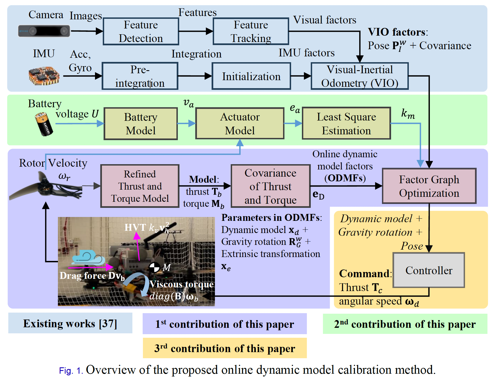

# QUADROTOR_DYNAMIC

### Abstract

Precise dynamic model calibration is essential in achieving reliable control of unmanned aerial vehicles (UAV). However, the existing methods tend to use simplified dynamic models and cannot adapt to variations of the dynamic model. To fill this gap, this paper explores an online dynamic model calibration (ODMC) method for the quadrotor based on factor graph optimization (FGO). First, the dynamic model is derived with more error terms, such as the center of gravity (CoG), aerodynamic drag, horizontal velocity-induced thrust (HVT) disturbance, and viscous effect. Moreover, the IMU-body extrinsic parameters and the gravity vector are also identified online. Second, the pose is estimated based on the visual-inertial odometry (VIO) together with the dynamic model parameters. The proposed method is validated using open-source and self-collected datasets. The evaluation demonstrates that the ODMC performs even better than the state-of-the-art data-driven methods (DDM) in force and torque prediction when the maximum velocity is less than 9 m/s. Furthermore, the effectiveness of the proposed method is validated by applying the estimated model in the differential-flatness-based controller (DFBC). Finally, we open-source code and datasets at https://github.com/RoboticsPolyu/QUAD_DYN to benefit the research community.

### Dependencies
    gtsam-4.0.3

### Hardware Framework

We open source the design and code of the TSB at [Google Drive](https://https://drive.google.com/drive/folders/16ANSew4QLOJO7UDyeyYslCdP4t9QSap4?usp=sharing).

### Blackbird Dataset

    Aerial_vehicle_calibration_BLACK

### NeuroBEM Dataset

    Batch_Fixed_Lag_Dynamics_NBEM
